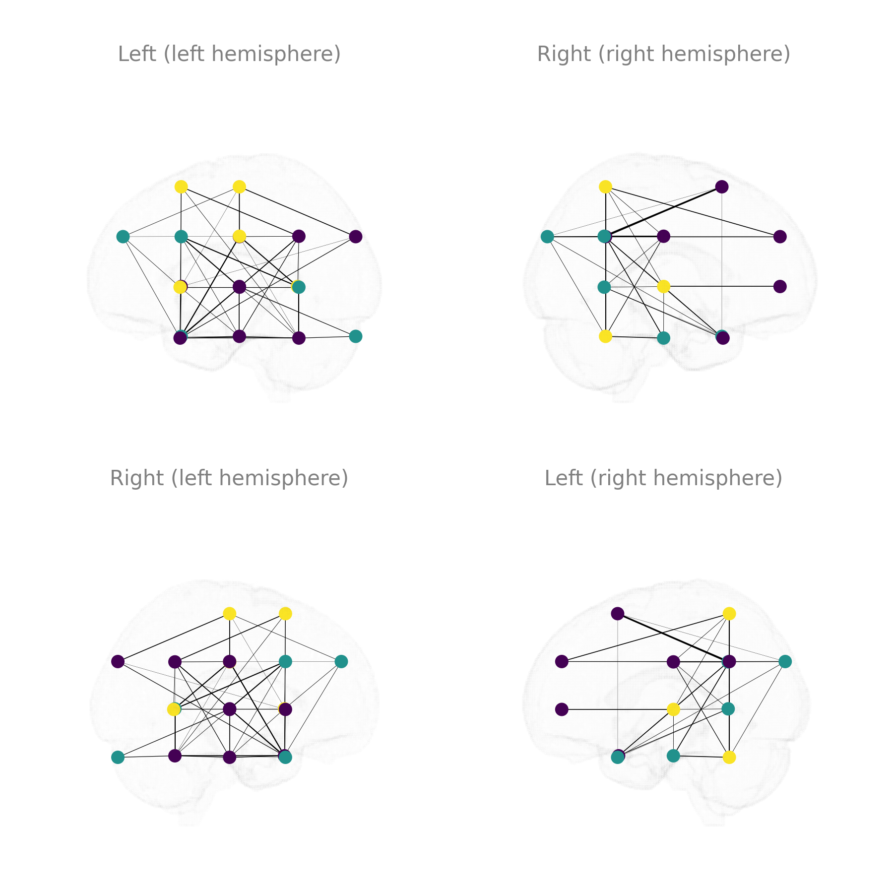

# netplotbrain: a showcase of visualization examples

### Import necessary packages and load data

```python

import netplotbrain
import pandas as pd
import matplotlib.pyplot as plt

# Node and edge dataframes 

nodes = pd.read_csv('./example_nodes.tsv', sep='\t', index_col=0)
edges = pd.read_csv('./example_edges.tsv', sep='\t', index_col=0)

```

### Plot each component separately and then all components together

```python
fig = plt.figure()

# Plot only template
ax = fig.add_subplot(141, projection='3d')
netplotbrain.plot(template='MNI152NLin6Asym',
                  templatestyle='surface',
                  templatealpha=0.08,
                  view='L',
                  arrowaxis=None,
                  subitles=None,
                  fig=fig, ax=ax)

# Plot only nodes
ax = fig.add_subplot(142, projection='3d')
netplotbrain.plot(nodes={'atlas': 'Schaefer2018',
                           'desc': '100Parcels7Networks',
                           'resolution': 1},
                  template='MNI152NLin6Asym',
                  templatestyle=None,
                  templatealpha=0.08,
                  nodetype='spheres',
                  view='L',
                  arrowaxis=None,
                  subtitles=None,
                  fig=fig, ax=ax)
                  
# Plot only edges
ax = fig.add_subplot(143, projection='3d')
netplotbrain.plot(nodes={'atlas': 'Schaefer2018',
                           'desc': '100Parcels7Networks',
                           'resolution': 1},                  
                 edges=edges,
                 template='MNI152NLin6Asym',
                 templatestyle=None,
                 view='L',
                 nodealpha=0,
                 edgeweights='weight',
                 edgealpha=5,
                 arrowaxis=None,
                 subtitles=None,
                 fig=fig, ax=ax)

# Plot template, nodes, and edges together
ax = fig.add_subplot(144, projection='3d')
netplotbrain.plot(nodes={'atlas': 'Schaefer2018',
                           'desc': '100Parcels7Networks',
                           'resolution': 1},                                    
                 edges=edges,
                 template='MNI152NLin6Asym',
                 templatestyle='surface',
                 templatealpha=0.08,
                 view='L',
                 nodetype='spheres',
                 nodecolor='Salmon',
                 edgeweights='weight',
                 edgealpha=5,
                 arrowaxis=None,
                 subtitles=None,
                 fig=fig, ax=ax)
plt.show()
```


### Plot different template styles

```python
fig = plt.figure()

# Plot surface style 
ax = fig.add_subplot(141, projection='3d')
netplotbrain.plot(template='MNI152NLin6Asym',
                  templatestyle='surface',
                  view='A',
                  arrowaxis=None,
                  subtitles='surface',
                  fig=fig, ax=ax)

# Plot filled style 
ax = fig.add_subplot(142, projection='3d')
netplotbrain.plot(template='MNI152NLin6Asym',
                  templatestyle='filled',
                  view='A',
                  arrowaxis=None,
                  subtitles='filled',
                  fig=fig, ax=ax)

# Plot cloudy style 
ax = fig.add_subplot(143, projection='3d')
netplotbrain.plot(template='MNI152NLin6Asym',
                  templatestyle='cloudy',
                  templatevoxelsize=2,
                  templatealpha=0.065,
                  view='A',
                  arrowaxis=None,
                  subtitles='cloudy',
                  fig=fig, ax=ax)

# Plot glass style 
ax = fig.add_subplot(144, projection='3d')
netplotbrain.plot(template='MNI152NLin6Asym',
                  templatestyle='glass',
                  view='A',
                  arrowaxis=None,
                  subtitles='glass',
                  template_glass_maxalpha=0.035,
                  fig=fig, ax=ax)
plt.show()
```


### Plot hemispheres and whole brain

```python
fig = plt.figure()

### Plot hemispheres and whole brain
netplotbrain.plot(template='MNI152NLin6Asym',
                  templatestyle='surface',
                  view=['SSS'],
                  hemisphere=['L', 'R', ''],
                  nodecolor='darkcyan',
                  subtitles=['left hemisphere', 'right hemisphere', 'whole brain'],
                  nodes=nodes,
                  arrowaxis=None,
                  edges=edges)
                  
plt.show()
```


```python
fig = plt.figure()

# Circles
ax = fig.add_subplot(131, projection='3d')
netplotbrain.plot(nodes={'atlas': 'Schaefer2018',
                            'desc': '100Parcels7Networks',
                            'resolution': 1},
                  template='MNI152NLin6Asym',
                  templatestyle='glass',
                  template_glass_maxalpha=0.03,
                  view='S',
                  nodetype='circles',
                  nodescale=40,
                  nodealpha=1,
                  arrowaxis=None,
                  title='Circles',
                  fig=fig, ax=ax)

# Spheres
ax = fig.add_subplot(132, projection='3d')
netplotbrain.plot(nodes={'atlas': 'Schaefer2018',
                            'desc': '100Parcels7Networks',
                            'resolution': 1},
                  template='MNI152NLin6Asym',
                  templatestyle='glass',
                  template_glass_maxalpha=0.03,
                  view='S',
                  nodetype='spheres',
                  nodealpha=1,
                  arrowaxis=None,
                  title='Spheres',
                  fig=fig, ax=ax)

# Parcels
ax = fig.add_subplot(133, projection='3d')
netplotbrain.plot(nodes={'atlas': 'Schaefer2018',
                           'desc': '100Parcels7Networks',
                           'resolution': 1},
                  template='MNI152NLin6Asym',
                  templatestyle=None,
                  view='S',
                  nodetype='parcels',
                  nodealpha=1,
                  nodecolor='tab20c',
                  arrowaxis=None,
                  title='Parcels',
                  fig=fig, ax=ax)

plt.show()
```


### Customize nodes

```python
fig = plt.figure()

# Plot 10 nodes with the same color
ax = fig.add_subplot(131, projection='3d')
netplotbrain.plot(nodes=nodes,
                  template='MNI152NLin6Asym',
                  templatestyle='surface',
                  templatealpha=0.1,
                  view='S',
                  nodetype='spheres',
                  nodecolor='magenta',
                  nodealpha=0.1,
                  highlightnodes=[20,21,22,25,24,27,29,31,32,33], 
                  arrowaxis=None,
                  subtitles=None,
                  fig=fig, ax=ax)

# Plot 10 nodes colored by their community of origin
ax = fig.add_subplot(132, projection='3d')
netplotbrain.plot(nodes=nodes,
                  template='MNI152NLin6Asym',
                  templatestyle='surface',
                  templatealpha=0.1,
                  view='S',
                  nodetype='spheres',
                  highlightnodes=[20,21,22,25,24,27,29,31,32,33], 
                  nodecolor='community',
                  nodecmap='cool',
                  nodealpha=0.1,
                  arrowaxis=None,
                  subtitles=None,
                  nodecolorlegend=False,
                  fig=fig, ax=ax)

# Plot 10 nodes colored by their community of origin and re-sized according to centrality measure
ax = fig.add_subplot(133, projection='3d')
netplotbrain.plot(nodes=nodes,
                  template='MNI152NLin6Asym',
                  templatestyle='surface', 
                  templatealpha=0.1,
                  view='S',
                  highlightnodes=[20,21,22,25,24,27,29,31,32,33],
                  nodetype='spheres', 
                  nodecolor='community',
                  nodecmap='cool',
                  nodesize='centrality_measure2',
                  nodealpha=0.1,
                  nodescale=9,
                  subtitles=None,
                  arrowaxis=None,
                  nodecolorlegend=False,
                  nodesizelegend=False,
                  fig=fig, ax=ax)
                        
plt.show()
```


### Plot different templates pulled from TemplateFlow

```python
fig = plt.figure()

# Adult template
ax = fig.add_subplot(131, projection='3d')
netplotbrain.plot(nodes={'atlas': 'Schaefer2018',
                         'desc': '100Parcels7Networks',
                         'resolution': 1},
                  template='MNI152NLin6Asym',
                  templatestyle='surface',
                  view='S',
                  nodecolor='blue',
                  nodealpha=1,
                  nodescale=15,
                  arrowaxis=None,
                  showlegend=False,
                  subtitles='Adult template MNI152NLin6Asym',
                  fig=fig, ax=ax)
                  
# Rat template
nodes_whs = nodes.copy()
nodes_whs['x'] = nodes_whs['x'] / 8
nodes_whs['y'] = nodes_whs['y'] / 8
nodes_whs['z'] = nodes_whs['z'] / 8

ax = fig.add_subplot(132, projection='3d')
netplotbrain.plot(nodes=nodes_whs,
                  template='WHS',
                  templatestyle='surface',
                  templatealpha=0.3,
                  view='S',
                  nodescale=15,
                  nodecolor='blue',
                  nodealpha=1,
                  arrowaxis=None,
                  showlegend=False,
                  subtitles='Rat template WHS',
                  fig=fig, ax=ax)

# Infant template
nodes_inf = nodes.copy()
nodes_inf['x'] = nodes_inf['x'] / 1.25
nodes_inf['y'] = nodes_inf['y'] / 1.25
nodes_inf['z'] = nodes_inf['z'] / 1.25

# Setting a larger templatevoxsize will make it slightly quicker
ax = fig.add_subplot(133, projection='3d')
netplotbrain.plot(nodes=nodes_inf,
                  template='MNIInfant_cohort-3',
                  templatestyle='surface',
                  templatealpha=0.3,
                  view='S',
                  nodecolor='blue',
                  nodescale=15,
                  showlegend=False,
                  arrowaxis=None,
                  subtitles='Infant template MNIInfant',
                  fig=fig, ax=ax)
                  
plt.show()
```


### Plot different views and rotations

#### Multiple views on multiple rows

```python
# 6 views
netplotbrain.plot(nodes=nodes,
                  edges=edges,
                  edgescale=5,
                  template='MNI152NLin6Asym',
                  templatestyle='glass',
                  template_glass_maxalpha=0.07,
                  view='preset-6',
                  nodecolor='community',
                  nodecmap='viridis',
                  nodetype='circles',
                  nodescale=12,
                  nodealpha=1,
                  arrowaxis=None,
                  showlegend=False)
                  
plt.show()
```


```python
# 4 views
netplotbrain.plot(nodes=nodes,
                  edges=edges,
                  edgescale=5,
                  template='MNI152NLin6Asym',
                  templatestyle='glass',
                  template_glass_maxalpha=0.07,
                  view='preset-4',
                  nodecolor='community',
                  nodecmap='viridis',
                  nodetype='circles',
                  nodescale=12,
                  nodealpha=1,
                  arrowaxis=None,
                  showlegend=False)
                  
plt.show()
```


#### AP rotation with 4 frames

```python
netplotbrain.plot(nodes=nodes,
                  edges=edges,
                  edgescale=5,
                  template='MNI152NLin6Asym',
                  templatestyle='glass',
                  template_glass_maxalpha=0.07,
                  view=['AP'],
                  frames=4,
                  nodecolor='community',
                  nodecmap='cividis',
                  nodetype='circles',
                  nodescale=12,
                  nodealpha=1,
                  showlegend=False)
                  
plt.show()
```


#### AP rotation with 5 frames

```python
netplotbrain.plot(nodes=nodes,
                  edges=edges,
                  edgescale=5,
                  template='MNI152NLin6Asym',
                  templatestyle='glass',
                  template_glass_maxalpha=0.07,
                  view=['AP'],
                  frames=5,
                  nodecolor='community',
                  nodecmap='cividis',
                  nodetype='circles',
                  nodescale=12,
                  nodealpha=1,
                  showlegend=False)
                  
plt.show()
```

