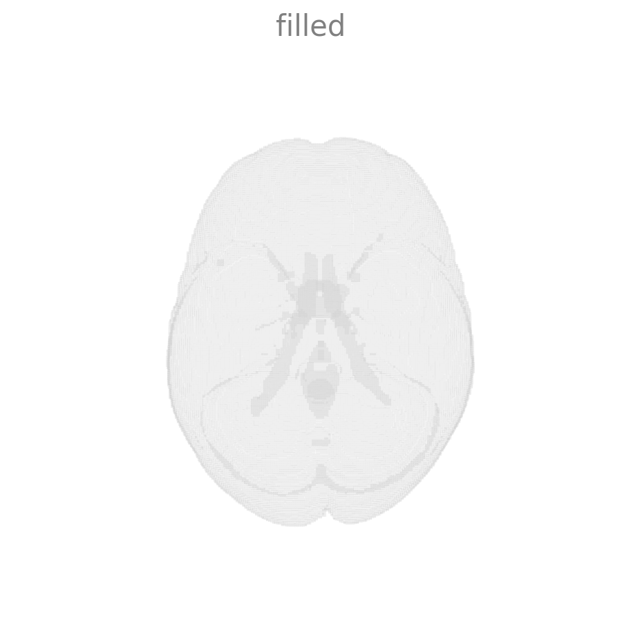
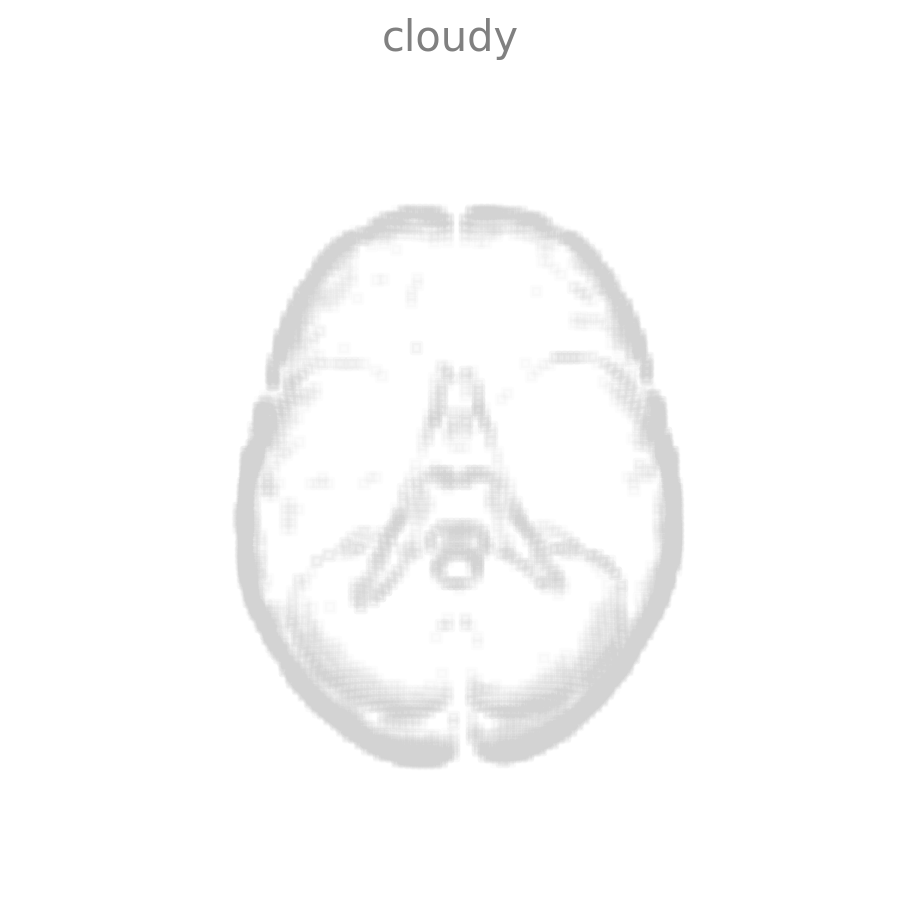
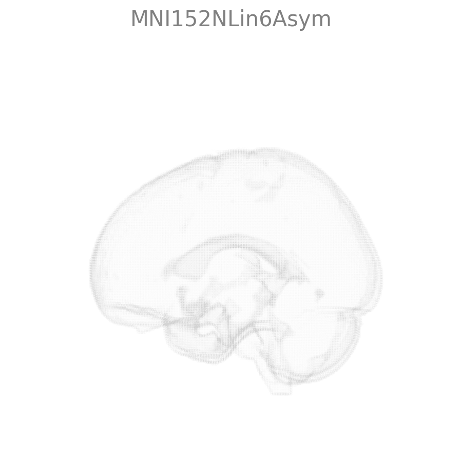
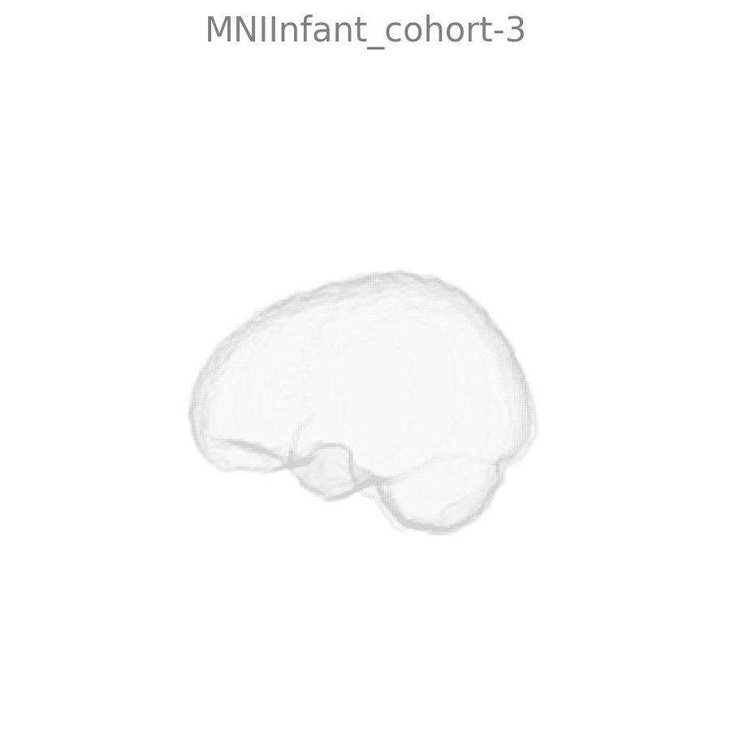
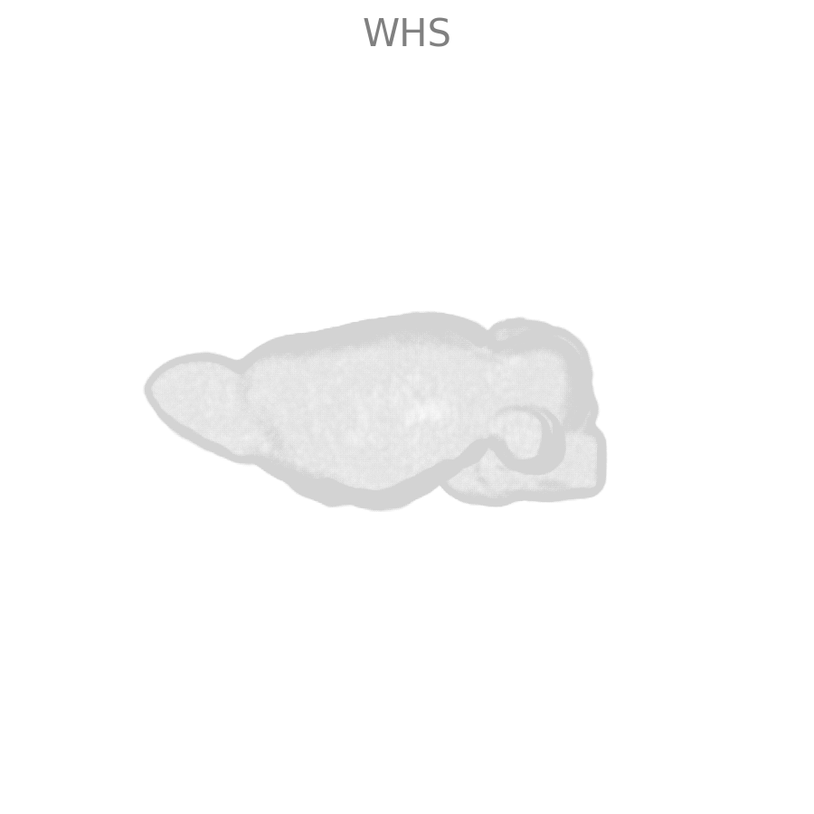
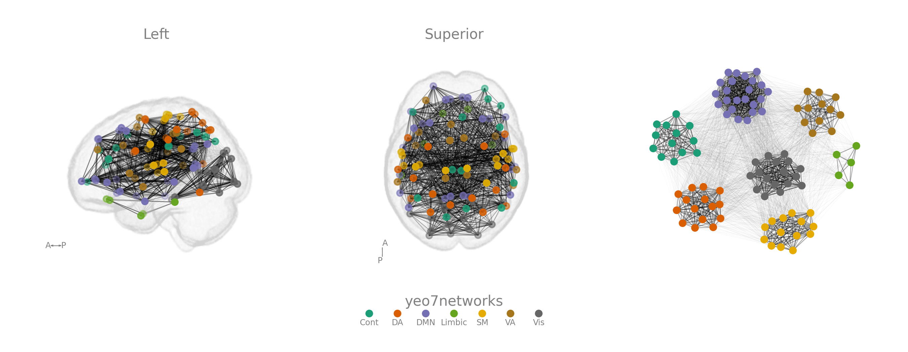

# netplotbrain: a showcase of visualization examples

### Import necessary packages and load data

```python

import netplotbrain
import pandas as pd
import numpy as np
import templateflow.api as tf
import itertools
import matplotlib.pyplot as plt

# Node and edge dataframes 

nodes = pd.read_csv('./example_nodes.tsv', sep='\t', index_col=0)
edges = pd.read_csv('./example_edges.tsv', sep='\t', index_col=0)
nodes_custom = pd.read_csv('./example_nodes_fig_4.csv', sep='\t', index_col=0)

```

### Plot each component separately and then all components together

```python
fig = plt.figure()

# Plot only template
ax = fig.add_subplot(141, projection='3d')
netplotbrain.plot(template='MNI152NLin6Asym',
                  template_style='surface',
                  template_alpha=0.08,
                  view='L',
                  arrowaxis=None,
                  title=None,
                  fig=fig, ax=ax)

# Plot only nodes
ax = fig.add_subplot(142, projection='3d')
netplotbrain.plot(nodes={'atlas': 'Schaefer2018',
                           'desc': '100Parcels7Networks',
                           'resolution': 1},
                  template='MNI152NLin6Asym',
                  template_style=None,
                  template_alpha=0.08,
                  node_type='spheres',
                  view='L',
                  arrowaxis=None,
                  title=None,
                  fig=fig, ax=ax)
                  
# Plot only edges
ax = fig.add_subplot(143, projection='3d')
netplotbrain.plot(nodes={'atlas': 'Schaefer2018',
                           'desc': '100Parcels7Networks',
                           'resolution': 1},                  
                 edges=edges,
                 template='MNI152NLin6Asym',
                 template_style=None,
                 view='L',
                 node_alpha=0,
                 edge_weights='weight',
                 arrowaxis=None,
                 title=None,
                 fig=fig, ax=ax)

# Plot template, nodes, and edges together
ax = fig.add_subplot(144, projection='3d')
netplotbrain.plot(nodes={'atlas': 'Schaefer2018',
                           'desc': '100Parcels7Networks',
                           'resolution': 1},                                    
                 edges=edges,
                 template='MNI152NLin6Asym',
                 template_style='surface',
                 view='L',
                 node_type='spheres',
                 edge_weights='weight',
                 arrowaxis=None,
                 title=None,
                 fig=fig, ax=ax)
plt.show()
```


### Plot different template styles

```python
# Plot glass style 
netplotbrain.plot(template='MNI152NLin6Asym',
                  template_style='glass',
                  view='S',
                  arrowaxis=None,
                  title='glass',
                  subtitles=None)
 plt.show()
 ```


```python
# Plot surface style 
netplotbrain.plot(template='MNI152NLin6Asym',
                  template_style='surface',
                  view='S',
                  arrowaxis=None,
                  title='surface',
                  subtitles=None)
plt.show()
 ```


```python
# Plot filled style 
netplotbrain.plot(template='MNI152NLin6Asym',
                  template_style='filled',
                  view='S',
                  arrowaxis=None,
                  title='filled',
                  subtitles=None)
plt.show()
 ```


```python
# Plot cloudy style 
netplotbrain.plot(template='MNI152NLin6Asym',
                  template_style='cloudy',
                  template_voxelsize=2,
                  template_alpha=0.065,
                  view='S',
                  template_edgethreshold=0.6,
                  arrowaxis=None,
                  title='cloudy',
                  subtitles=None)
plt.show()
```


### Plot different node types

```python
# Circles
netplotbrain.plot(nodes={'atlas': 'Schaefer2018',
                            'desc': '100Parcels7Networks',
                            'resolution': 1},
                  template='MNI152NLin6Asym',
                  template_style='glass',
                  view='S',
                  node_type='circles',
                  node_scale=40,
                  node_alpha=1,
                  arrowaxis=None,
                  title='circles',
                  subtitles=None)
plt.show()
```


```python
# Spheres
netplotbrain.plot(nodes={'atlas': 'Schaefer2018',
                            'desc': '100Parcels7Networks',
                            'resolution': 1},
                  template='MNI152NLin6Asym',
                  template_style='glass',
                  view='S',
                  node_type='spheres',
                  node_alpha=1,
                  arrowaxis=None,
                  title='spheres',
                  subtitles=None)
plt.show()
```


```python
# Parcels
netplotbrain.plot(nodes={'atlas': 'Schaefer2018',
                           'desc': '100Parcels7Networks',
                           'resolution': 1},
                  template='MNI152NLin6Asym',
                  template_style=None,
                  view='S',
                  node_type='parcels',
                  node_alpha=1,
                  node_color='tab20c',
                  arrowaxis=None,
                  title='parcels',
                  subtitles=None)
plt.show()
```


### Customize nodes

```python
# Plot 16 nodes with the same color
netplotbrain.plot(nodes=nodes_custom,
                  template='MNI152NLin6Asym',
                  view='S',
                  node_scale=50,
                  title=None,
                  arrowaxis=None)
plt.show()
```


```python
# Plot 16 nodes colored by their community of origin
netplotbrain.plot(nodes=nodes_custom,
                  template='MNI152NLin6Asym',
                  view='S',
                  node_color='Community',
                  node_cmap='tab10',
                  node_scale=50,
                  title=None,
                  arrowaxis=None)
plt.show()
```


```python
# Plot 16 nodes colored by their community of origin and re-sized according to centrality measure 1
netplotbrain.plot(nodes=nodes_custom,
                  template='MNI152NLin6Asym',
                  view='S',
                  node_color='Community',
                  node_cmap='tab10',
                  node_size='Measure-1',
                  node_scale=50,
                  title=None,
                  arrowaxis=None)    
plt.show()
```


```python
# Plot 16 nodes colored by their community of origin and re-sized according to centrality measure 2
netplotbrain.plot(nodes=nodes_custom,
                  template='MNI152NLin6Asym',
                  view='S',
                  node_color='Community',
                  node_cmap='tab10',
                  node_size='Measure-2',
                  node_scale=50,
                  title=None,
                  arrowaxis=None)    
plt.show()
```


### Plot different templates pulled from TemplateFlow

```python
# Adult brain MNI152NLin6Asym
netplotbrain.plot(template='MNI152NLin6Asym',
                  template_style='glass',
                  view='L',
                  arrowaxis=None,
                  title='MNI152NLin6Asym',
                  subtitles=None)                
plt.show()
```


```python
# Infant template MNIInfant_cohort-3
# Setting a larger templatevoxsize will make it slightly quicker
netplotbrain.plot(template='MNIInfant_cohort-3',
                  template_style='glass',
                  view='L',
                  arrowaxis=None,
                  title='MNIInfant_cohort-3',
                  subtitles=None)
plt.show()
```


```python
# Rat template WHS
netplotbrain.plot(template='WHS',
                  template_style='glass',
                  view='L',
                  arrowaxis=None,
                  title='WHS',
                  subtitles=None)                  
plt.show()
```
               

```python
# Squirrel monkey VALiDATe29 
netplotbrain.plot(template='VALiDATe29',
                  template_style='glass',
                  view='L',
                  arrowaxis=None,
                  title='VALiDATe29',
                  subtitles=None)                  
plt.show()
```


### Plot different views and rotations

#### Multiple views on multiple rows

```python
# 6 views
netplotbrain.plot(nodes=nodes,
                  edges=edges,
                  edge_scale=5,
                  template='MNI152NLin6Asym',
                  template_style='glass',
                  view='preset-6',
                  node_color='community',
                  node_cmap='viridis',
                  node_scale=30,
                  node_alpha=1,
                  arrowaxis=None,
                  showlegend=False)                  
plt.show()
```


```python
# 4 views
netplotbrain.plot(nodes=nodes,
                  edges=edges,
                  edge_scale=5,
                  template='MNI152NLin6Asym',
                  template_style='glass',
                  view='preset-4',
                  node_color='community',
                  node_cmap='viridis',
                  node_scale=30,
                  node_alpha=1,
                  arrowaxis=None,
                  showlegend=False)
plt.show()
```


#### AP rotation with 4 frames

```python
netplotbrain.plot(nodes=nodes,
                  edges=edges,
                  edge_scale=5,
                  template='MNI152NLin6Asym',
                  template_style='glass',
                  view='AP',
                  frames=4,
                  node_color='community',
                  node_cmap='viridis',
                  node_scale=30,
                  node_alpha=1,
                  showlegend=False)                  
plt.show()
```


#### AP rotation with 5 frames

```python
netplotbrain.plot(nodes=nodes,
                  edges=edges,
                  edge_scale=5,
                  template='MNI152NLin6Asym',
                  template_style='glass',
                  view='AP',
                  frames=5,
                  node_color='community',
                  node_cmap='viridis',
                  node_scale=30,
                  node_alpha=1,
                  showlegend=False)
plt.show()
```


### Spring layout subplot 

```python
# Set random seed for reproducibility
np.random.seed(2022)

# Download 100 nodes from the Schaefer atlas from templateflow
atlas = {'template': 'MNI152NLin2009cAsym',
         'atlas': 'Schaefer2018',
        'desc': '100Parcels7Networks'}
atlasinfo = tf.get(extension='.tsv', **atlas)
atlasinfo = pd.read_csv(atlasinfo, sep='\t')
# Resolution argument needed in atlas later nii.gz file
atlas['resolution'] = 1
# Parse the info in to get network names
networks = list(map(lambda x: x.split('_')[2], atlasinfo.name.values))
atlasinfo['yeo7networks'] = networks
# Rename longer network names
atlasinfo['yeo7networks'].replace('DorsAttn', 'DA', inplace=True)
atlasinfo['yeo7networks'].replace('SalVentAttn', 'VA', inplace=True)
atlasinfo['yeo7networks'].replace('Default', 'DMN', inplace=True)
atlasinfo['yeo7networks'].replace('SomMot', 'SM', inplace=True)

# Create empty cognitive matrix
edges = np.random.normal(0, 0.025, [100, 100])

# Set within network connectivity to be stronger
for network in atlasinfo['yeo7networks'].unique():
    idx =  atlasinfo[atlasinfo['yeo7networks']==network].index
    idx_pairs = np.array(list(itertools.combinations(idx, 2)))
    edges[idx_pairs[:, 0], idx_pairs[:, 1]] = np.random.normal(0.5, 0.025, [len(idx_pairs)])
    edges[idx_pairs[:, 1], idx_pairs[:, 0]] = np.random.normal(0.5, 0.025, [len(idx_pairs)])
    
# Plot it all
netplotbrain.plot(template='MNI152NLin2009cAsym',
                  nodes=atlas,
                  nodes_df=atlasinfo,
                  edges=edges,
                  view='LSs',
                  template_style='glass',
                  node_scale=20,
                  node_color='yeo7networks',
                  edge_threshold=0,
                  edge_alpha=0.2,
                  edge_thresholddirection='>',
                  seed=2022)
plt.show()
```


